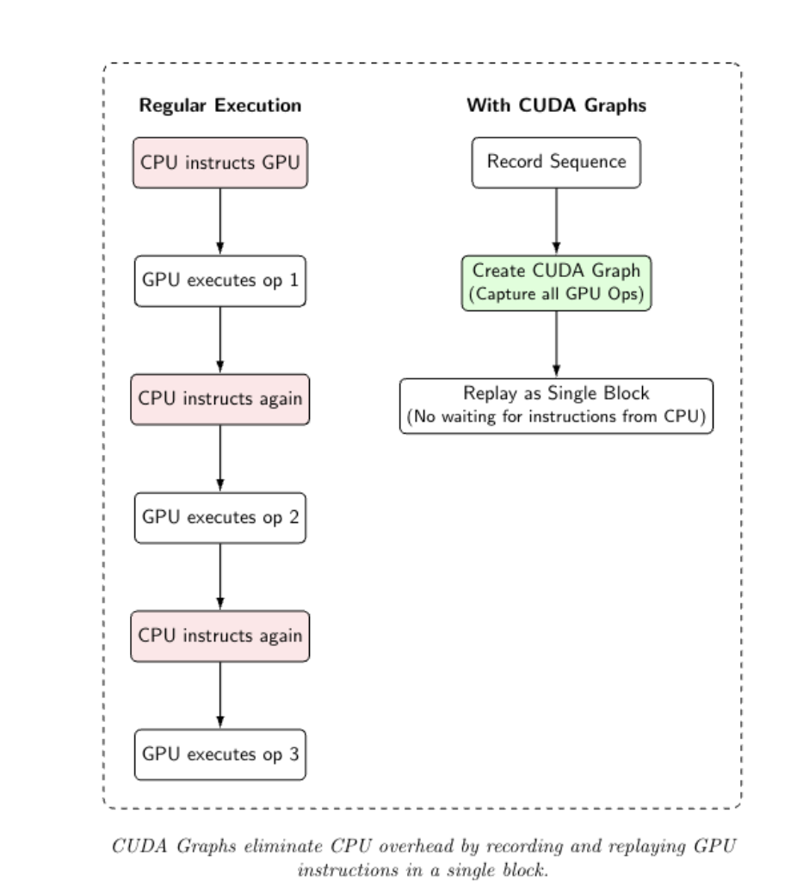
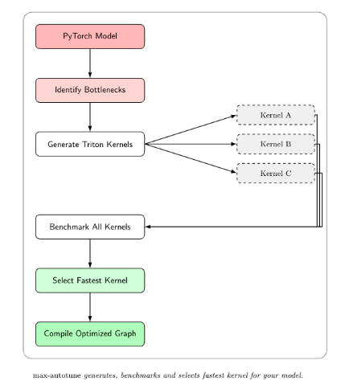

# Lab 7 - Model Optimization for Inference

## Introduction

In this lab, we will focus on optimizing neural network models for faster inference. 
There are many techniques available in PyTorch, including: 

* switching the model to **evaluation** mode and disabling gradient computation
* various strategies for GPU speedup, e.g. optimized tensor placement, pinning memory,
  lower precision calculations
* using the `torch.compile()` function for automatic model compilation
* **model quantization** to reduce size and speed up computations
* exporting the model to ONNX format and ONNX Runtime optimization

These techniques allow you to **speed up** the inference and **reduce resource usage**,
which are crucial when deploying ML models to production systems. They are particularly
useful for low-latency applications (e.g. online services, streaming ML), as well as for
mobile and edge deployments with limited resources.

### Environment note

We recommend using a local Python environment managed with `uv`. If you encounter problems
or do not have a CUDA-compatible GPU (e.g. on macOS), you can use Google Colab. In that case,
remember to enable the GPU accelerator in the runtime settings.

In the following exercises, we will use a pretrained Sentence Transformer model,
`sentence-transformers/multi-qa-mpnet-base-cos-v1`. It embeds sentences as 768-dimensional vectors.

## 1. Evaluation mode

When using PyTorch for inference, there are several optimizations that can be applied to reduce the overhead of the model.
They include:

1. Model evaluation (eval) mode - it disables layers used only during training (e.g. dropout, batch normalization).
   Used with `model.eval()` method.
2. Disabling gradients - during inference, gradients are not needed, so it omits tracking them and allocating memory
   for them. Used with `torch.no_grad()` context manager, or preferably with a more recently added and more performant
   `torch.inference_mode()`.
3. Inference loop optimization - avoid unnecessary repetition of operations, e.g. move model to a device beforehand,
   pre-allocate memory.

For differences between `no_grad()` and `inference_mode()`, see:
- [this StackOverflow answer](https://stackoverflow.com/a/74197846/9472066)
- [PyTorch forum discussion](https://discuss.pytorch.org/t/pytorch-torch-no-grad-vs-torch-inference-mode/134099)
- [PyTorch docs on grad modes](https://docs.pytorch.org/docs/stable/notes/autograd.html#grad-modes)

### Exercise 1 (3 points)

1. Load the `sentence-transformers/multi-qa-mpnet-base-cos-v1` model and tokenizer. Use the `AutoModel` and
   `AutoTokenizer` classes from `tranformers` library.
2. Create a sample input text and tokenize it (padding, truncation, `return_tensors="pt"`).
3. Measure the inference time of the model in various inference modes (average time over 100 runs):
   - no optimizations (simple PyTorch)
   - `model.eval()`
   - `model.eval()` and `no_grad()`
   - `model.eval()` and `inference_mode()`
4. Compare the speedup of options 2, 3, and 4 over the pure PyTorch. To calculate speedup, divide the
   PyTorch time by the current time. 

In general, the time should decrease for subsequent options. If `inference_mode()` is slower than `no_grad()`, 
it may be due some not supported operations in the model, so `no_grad()` is preferred in such cases. 
But when models contain many operations and overhead with autograd is significant, `inference_mode()` should be faster.

## 2. PyTorch model compilation

PyTorch 2.0 introduced a new functionality, model compilation, which automatically optimizes model execution
via `torch.compile()` function.

This mechanism uses modules such as **TorchDynamo** and **TorchInductor** under the hood to capture the model
computation graph and generate optimized low-level code. The default backend (TorchInductor) can generate
optimized CUDA kernels on GPU, and optimized vectorized code on CPU. It can also fuse operations together and
bypass the overhead of memory transfers and Python interpreter.

Note that `torch.compile()` is a lossless model optimization technique, changing only its physical execution.
You should call it after setting the model to evaluation mode, so that the computation graph contains only the
final inference operations.

Example usage:

```python
model.eval()
compiled_model = torch.compile(model)
```

The above line returns a compiled version of the model that can be used just like the original model.
During the first inference call, the model execution operations are traced and its computation graph is optimized,
which incurs an overhead, which can be quite significant. Further calls will use the generated optimized code,
which should be significantly faster.

### Exercise 2 (2 points)

In this exercise, we will verify the gains from model compilation with `torch.compile()`.

1. Compile the model using `torch.compile()` after switching it to evaluation mode, and warm-up the model
   by running a single inference call. Measure this compilation + warm-up time (just once).
2. Measure the inference time (average of 100 runs) of the compiled model in inference mode.
3. Calculate the speedup, and compare results with those from the previous exercise.

## 3. Quantization

Another way to optimize a model is to **quantize** its weights, reducing its size, but also the precision.
Quantization means representing parameters (weights, and optionally also activations) with lower precision
than the standard 32 bits. Most often, this means switching to 8-bit integers, i.e. dtype `int8`.

PyTorch provides built-in tools for both **dynamic** and **static quantization**.

**Dynamic quantization:**
- convert weights `fp32 -> int8`, while activations remain in `float32` and are quantized dynamically during
  model execution
- does not require any post-training calibration
- slower and more complex than static quantization, but also more precise
- most effective and popular on CPU, which widely support integer operations
- GPU usage requires specialized software & hardware (supporting `int8` operations)

**Static quantization:**
- quantize both weights and activations to `int8`
- typically requires calibration, i.e. passing data through the model to estimate value ranges to know
  how to quantize
- faster and simpler to execute, but may be less precise (due to rounding activations)
- more frequently used in production, particularly because the saved model files are smaller in this mode

### Exercise 3 (3 points)

We will perform a dynamic quantization for our model, which is very simple operationally to use with PyTorch.
It provides the `torch.ao.quantization.quantize_dynamic()` function, to which we pass the model and a 
list of layer types that we want to quantize. In the case of transformers, those are primarily the linear
layers, which contain the majority of weights and perform most computations.

1. Ensure the model is on the CPU.
2. Quantize the model with `torch.ao.quantization.quantize_dynamic()`, setting the target weight to `torch.qint8` and
   layers to a single-element set with `nn.Linear`.
3. Save the model to a new variable (e.g. `model_quantized`), and print it to verify that linear layers have been
   quantized properly (i.e. `DynamicQuantizedLinear` instead of `Linear`).
4. Save both models to disk (`state_dict` for both) and compare the file sizes (e.g. `os.path.getsize()`).
5. Compare the inference speed and speedup on CPU for original and quantized models (again, average of 100 runs).
6. Display the comparison. Do you think that quantization is helpful in this case?

Typically, we would observe the reduction in model size up to 4x and speedup of 1.5-2x, depending on the model type
and what parameters exactly are quantized.

## 4. GPU optimization strategies

### GPU inference

The most straightforward way to speed up inference is to run the model on a GPU if you have a suitable card
and can afford that in the production environment. Deep models typically run much faster on GPU than on CPU,
especially for larger batches.

For example:
```python
device = torch.device('cuda' if torch.cuda.is_available() else 'cpu')
model = model.to(device)
inputs_gpu = {k: v.to(device) for k, v in inputs.items()}
with torch.inference_mode():
    outputs = model(**inputs_gpu)
```

Transferring data to the GPU involves additional overhead, so it's done explicitly in PyTorch as above.
Due to this overhead, it may not be beneficial for tiny models and single inputs, so this should be
kept in mind for inference.

After transferring data to the GPU, it is also worth considering the use of `torch.compile()` on the model 
to gain additional acceleration through operator fusion and generation of optimized CUDA code. It works
similarly to CPU compilation that we tried before.


### CUDA Graphs

Launching individual GPU kernels for single operations incurs a significant overhead for many operations.
Each one requires memory allocation, memory transfer, and synchronization. Instead, we can combine them
in a **CUDA Graph**, replacing a sequence of kernels with a single, efficient operation.

```python
# Enable CUDA Graphs for maximum throughput
compiled_model_with_cudagraphs = torch.compile(model, mode="max-autotune")
```



The `max-autotune` mode of PyTorch compilation can generate entirely new operations on the fly. In this mode,
PyTorch creates several Triton kernel implementations for each operation, benchmarks their performance, and
selects the fastest one.



These automatically generated kernels often outperform naive operations, or even handwritten generic 
implementations, because they are tailored for a given model. For example, tensor shapes are known and
constant, and memory access patterns are predictable.

However, CUDA Graphs are **static** by design - they record a fixed sequence of operations with predefined
tensor shapes. This is problematic for models handling dynamic input sizes, e.g. variable-length sentences
in transformers or images with different size in CNNs. CUDA Graphs become invalid when input dimensions
change.

The `max-autotune-no-cudagraphs` mode addresses this limitation. It still creates custom Triton kernels,
optimized computation graphs, and fused operations, but allows the model to handle dynamic inputs without
recompilation. This is relevant to many production environments with unpredictable input sizes, providing
both flexibility and high performance.

```python
# Enable max-autotune without CUDA Graphs for dynamic input shapes
compiled_model_dynamic = torch.compile(model, mode="max-autotune-no-cudagraphs")
```

### Pinning GPU memory

When transferring data from CPU to GPU, using **pinned (page-locked) memory** can speed up the transfer process.
By default, PyTorch allocates tensors in pageable memory, which can be slower to transfer to GPU.
To allocate pinned memory, use the `pin_memory=True` argument when creating tensors or DataLoader.

Examples:

```python
inputs = tokenizer(sample_text, padding=True, truncation=True, return_tensors="pt", pin_memory=True)
```

```python
from torch.utils.data import DataLoader

dataloader = DataLoader(dataset, batch_size=32, pin_memory=True)
```

When transferring to GPU, pinned memory allows for faster transfers, improving overall throughput.

### Exercise 4 (2 points)

1. Compare inference time of:
   - `torch.compile()` with default settings
   - `torch.compile()` with `mode="max-autotune"`
   - `torch.compile()` with `mode="max-autotune-no-cudagraphs"`
2. Report the average time of 100 runs and speedup of the latter two modes.

Check a few different text input sizes. What happens in the latter two modes?

## 4. Changing numerical precision

Most modern CPU and GPU hardware can perform operations on 16-bit numbers (`float16` / `fp16`)
much faster than on 32-bit numbers (`float32` / `fp32`). This is because we can pack twice the
number of vectors into the same amount of memory, theoretically doubling the throughput. This is
also known as half-precision computation.

If your application can tolerate a minimal drop in accuracy, this kind of quantization (or precision
reduction, depending on definition) is really useful for inference. Since this is equal to just 
cutting particular bits, this can be done on the fly easily, and some frameworks support doing 
this on model loading for weights.

There are also other dedicated formats for neural networks. Newer NVidia GPUs also support `bfloat16`
type, which retains value range and only cuts precision bits, which typically works better for neural
networks. Further, we can use mixed precision, i.e. perform less sensitive operations in `fp16`
(e.g. convolution), and more precise ones in `fp32` (e.g. weights updates).

PyTorch also supports simplified automated casting to reduced precision types with `autocast`, see:
- [torch.amp documentation](https://docs.pytorch.org/docs/stable/amp.html)
- [torch.amp autocasting docs](https://docs.pytorch.org/docs/stable/amp.html#autocasting)
- [automated mixed precision PyTorch tutorial](https://docs.pytorch.org/tutorials/recipes/recipes/amp_recipe.html)

However, if your hardware does not support those types and fast operations, they probably will not
provide any speedup, or this may even slow down execution due to type casts.

You can check if your NVidia GPU supports fast float16 (via Tensor Cores) using the following code:

```python
import torch

capability = torch.cuda.get_device_capability()
print(f"CUDA device capability: {capability}")

# Tensor Cores are available on NVidia GPUs with CUDA >= 7 (e.g. Volta, Turing, Ampere, Hopper)
if capability >= (7, 0):
    print("Tensor Cores available: fast float16 supported.")
else:
    print("Tensor Cores not available: float16 may be slow or unsupported.")
```

Casting model weights and inputs to half-precision works as follows:

```python
model_half = model.half().to('cuda')
outputs = model_half(input_ids.to('cuda').half(), attention_mask.to('cuda').half())
```

You can also verify it by running:

```python
model_fp32 = torch.nn.Linear(10, 1)
data_fp32 = torch.randn(100, 10)
labels_fp32 = torch.randn(100, 1)

print(f"Data type of model_fp32 parameters: {model_fp32.weight.dtype}")
print(f"Data type of data_fp32: {data_fp32.dtype}")
print(f"Data type of labels_fp32: {labels_fp32.dtype}")

output_fp32 = model_fp32(data_fp32)
loss_fn = torch.nn.MSELoss()
loss_fp32 = loss_fn(output_fp32, labels_fp32)

print(f"Loss fp32: {loss_fp32.item()}")
```

```python
model_fp16 = model_fp32.half()
data_fp16 = data_fp32.half()
labels_fp16 = labels_fp32.half()

print(f"Data type of model_fp16 parameters: {model_fp16.weight.dtype}")
print(f"Data type of data_fp16: {data_fp16.dtype}")
print(f"Data type of labels_fp16: {labels_fp16.dtype}")

output_fp16 = model_fp16(data_fp16)
loss_fp16 = loss_fn(output_fp16.float(), labels_fp16.float())

print(f"Loss fp16: {loss_fp16.item()}")
```

### Exercise 5 (2 points)

1. Check if your GPU supports Tensor Cores (capability >= (7,0)). If not, switch to Google Colab with GPU runtime.
2. Measure inference time with:
   - full precision (`float32`)
   - manual half-precision (`float16`)
   - automatic mixed precision (`torch.autocast`)
3. Compare time and speedup. Which variant would you use in practice?

## 5. ONNX

ONNX (Open Neural Network eXchange) is a standardized format for representing neural networks. It abstracts
operations, turning the framework-specific code into an **execution graph** built from standardized operators.
It describes operations, input/output shapes, and model parameters in a hardware- and framework-agnostic way.
Then, it can be run with via ONNX Runtime (ORT), which can execute the code with kernels and optimizations from
specialized providers, like Intel OpenVINO or NVidia TensorRT.

ONNX and ONNX Runtime have considerable advantages:
1. Framework- and language-agnostic - ONNX runs on any framework and programming language, e.g. you can export
   PyTorch model in Python, and then run it in a Java application.
2. Execution graph optimization - ONNX Runtime provides a series of optimizations for the execution graph,
   including hardware-specific operators provided by manufacturers.
3. Lightweight deployment - ONNX & ORT have much smaller package size than the whole PyTorch (even CPU-only wheels),
   reducing sizes of dependencies and Docker containers, and accelerating loading.

In practice, `torch.compile()` works well for PyTorch optimization, but ONNX is preferable for deploying models,
particularly for lightweight or mobile runtimes. It also supports GPU inference via NVidia TensorRT provider.

Exporting to ONNX produces a raw computation graph in `.onnx` format. This file is:
- a static description of operators, weights, and I/O tensors
- a general graph - no hardware-specific rewrites happen during ONNX export
- hardware-agnostic - it does not contain CUDA/CPU kernels or provider information

We will export a Transformer model with dynamic batch size and dynamic sequence length.

```python
import torch
import torch.onnx

# Put the model in eval mode and move to CPU
model_cpu = model.eval().cpu()

# Example input for tracking (for onnx export)
sample_input = tokenizer(
    "This is a sample input text for ONNX export.",
    padding=True,
    truncation=True,
    return_tensors="pt",
)

# Export to ONNX format
torch.onnx.export(
    model_cpu,
    (sample_input["input_ids"], sample_input["attention_mask"]),
    "model.onnx",
    opset_version=17,
    input_names=["input_ids", "attention_mask"],
    output_names=["output"],
    dynamic_axes={
        "input_ids": {0: "batch_size", 1: "sequence_length"},
        "attention_mask": {0: "batch_size", 1: "sequence_length"},
        "output": {0: "batch_size"},
    },
)
```

We export on CPU in `eval()` mode to get deterministic behavior.

Look at how we marked dynamic axes in `dynamic_axes`:
1. For `input_ids` and `attention_mask`, we marked axes 0 (batch size) and 1 (sequence length) as dynamic,
   since they can vary during inference.
   - axis 0 - batch size, depends on number of inputs
   - axis 1 - sequence length, depends on text length
   - axis 2 - embedding size, fixed and constant (768), so we don't mark it
2. For `output`, we marked only axis 0 (batch size) as dynamic, since the output will have the same number
   of rows as the input batch size.

The exported `model.onnx` is a raw graph, not yet optimized. It can be changed during InferenceSession
creation in ONNX Runtime or when we explicitly run offline optimizations.

### Optimization & inference with ONNX Runtime

First, we run inference using ONNX Runtime with default settings. By default, all optimizations are applied.

```python
import onnxruntime as ort
import numpy as np

# Load the model
ort_session = ort.InferenceSession("model.onnx")

# Prepare input data
sample_input = tokenizer(
    "This is a sample input text for ONNX inference.",
    padding=True,
    truncation=True,
    return_tensors="np",
)


# Create input dictionary, in same format as during export
inputs_onnx = {
    "input_ids": sample_input["input_ids"],
    "attention_mask": sample_input["attention_mask"],
}

# Run inference
outputs_onnx = ort_session.run(None, inputs_onnx)
```

The raw ONNX is parsed, optimized (default level is `ORT_ENABLE_ALL`), and executed using the default
execution provider (generally generic CPU by default).

We did not specify a provider in this example to keep the code short. ONNX Runtime internally chooses 
providers based on how it was built (for example, CPU only, or CPU + CUDA). For production use, you 
should specify providers explicitly. We will do that in the next section.

### Graph optimization settings

ONNX Runtime groups graph optimizations into levels. Each level builds on the previous one:

1. **Basic graph optimizations** - semantics-preserving rewrites that remove redundant work. 
   They run before graph partitioning, so they apply to nodes regardless of the target execution provider.
2. **Extended graph optimizations** - They run after graph partitioning and are applied only to nodes 
   assigned to selected providers (CPU, CUDA, ROCm).
3. **Layout optimizations** - change layout from NHCW to NCHWc for CPU provider.

All optimizations are enabled by default. You can control them using the `GraphOptimizationLevel` enum:
* `ORT_DISABLE_ALL` – disable all optimizations
* `ORT_ENABLE_BASIC` – only basic
* `ORT_ENABLE_EXTENDED` – basic and extended
* `ORT_ENABLE_ALL` – basic + extended + layout optimizations (default)

### Online mode (load-time optimization)

In online mode, optimizations are applied each time you create an `InferenceSession`.
This happens when you create it:
```python
ort_session = ort.InferenceSession("model.onnx")
```
We can control the optimization level using `SessionOptions`:

```python
options = ort.SessionOptions()
options.graph_optimization_level = ort.GraphOptimizationLevel.ORT_ENABLE_ALL

ort_session = ort.InferenceSession(
    "model.onnx", sess_options=options, providers=["CPUExecutionProvider"]
)
```

Online mode is most convenient for:
- development and experimentation - you can quickly try out different settings
- dynamic environments - when running on different hardware or deployments, depending on settings

The cost of online mode is that optimization work is repeated each time a session is created, which
may be noticeable for large models. When you deploy to a known target each time, offline mode is
a better choice.

### Offline mode (ahead-of-time optimization)

In offline mode, optimizations are applied once, and the optimized model is saved to a new ONNX file. 
This can significantly reduce startup time in production environments. The key element is setting the
`SessionOptions.optimized_model_filepath`, which specifies where to save the optimized model.
When enabled, ONNX Runtime runs graph optimizations according to `graph_optimization_level`, and saves
the optimized model to the file.

```python
import onnxruntime as ort

sess_options = ort.SessionOptions()

# Choose the optimization level for the offline pass
sess_options.graph_optimization_level = ort.GraphOptimizationLevel.ORT_ENABLE_EXTENDED

# Save the optimized model to this path
sess_options.optimized_model_filepath = "model_optimized.onnx"

# Create InferenceSession, which will perform offline optimization and save the optimized model
ort.InferenceSession("model.onnx", sess_options)
```

After you can load this file and disable optimizations to avoid re-optimizing:

```python
# Load the optimized model without re-optimizing
sess_options = ort.SessionOptions()
sess_options.graph_optimization_level = ort.GraphOptimizationLevel.ORT_DISABLE_ALL

ort_session_optimized = ort.InferenceSession(
    "model_optimized.onnx", 
    sess_options=sess_options, 
    providers=['CPUExecutionProvider']
)
```

Offline mode is best suited for:
- production deployments - startup time is important, and the model changes only during training
- limited resource environments - repeated optimization is costly
- static hardware setups - when we know the hardware configuration, there is no need for re-optimization

### Executions Providers

Execution providers decide how and where the nodes of the ONNX graph are executed. They are not an
extra optimization pass on top of the graph. Instead, they are backends that provide concrete kernel
implementations for operators such as `MatMul`, `Conv`, `LayerNorm`, and so on.

Typical providers include:

* `CPUExecutionProvider`
* `CUDAExecutionProvider`
* `TensorrtExecutionProvider`
* `OpenVINOExecutionProvider`

The ONNX file itself is always hardware-agnostic. It does not contain any provider information.
Providers come into play only when you create an `InferenceSession`. Provider is responsible for:

* mapping ONNX operations to actual kernels, e.g. CPU BLAS vs cuBLAS vs TensorRT engines
* deciding which fused patterns it can execute efficiently for extended optimizations
* executing its part of the graph on the target hardware

So why do we need to care about providers? In production, it is better to be explicit, so that the behavior
does not change when you move the same model to a different environment.

```python
import onnxruntime as ort

options = ort.SessionOptions()
options.graph_optimization_level = ort.GraphOptimizationLevel.ORT_ENABLE_ALL

# Force CPU only
session_cpu = ort.InferenceSession(
    "model.onnx", sess_options=options, providers=["CPUExecutionProvider"]
)

# Prefer CUDA, fall back to CPU if CUDA is not available
session_cuda = ort.InferenceSession(
    "model.onnx",
    sess_options=options,
    providers=["CUDAExecutionProvider", "CPUExecutionProvider"],
)
```

For more information about providers, see the official [Execution Providers section](https://iot-robotics.github.io/ONNXRuntime/docs/execution-providers/).

### Exercise 6 (3 points)

1. Measure cold start time (including session creation) of the ONNX model using online and offline optimization modes
   on CPU.
2. Measure inference time of the ONNX model on CPU using both optimization modes.
3. Prepare deployment Docker images:
   - build two images, for a) compiled PyTorch model b) ONNX model with ONNX Runtime
   - select the best model in both cases in terms of the inference time
   - install a minimal set of requirements in both cases, e.g. do not install PyTorch for ONNX image
4. Compare for those apps:
   - Docker container sizes
   - response time (average of 100 requests)
