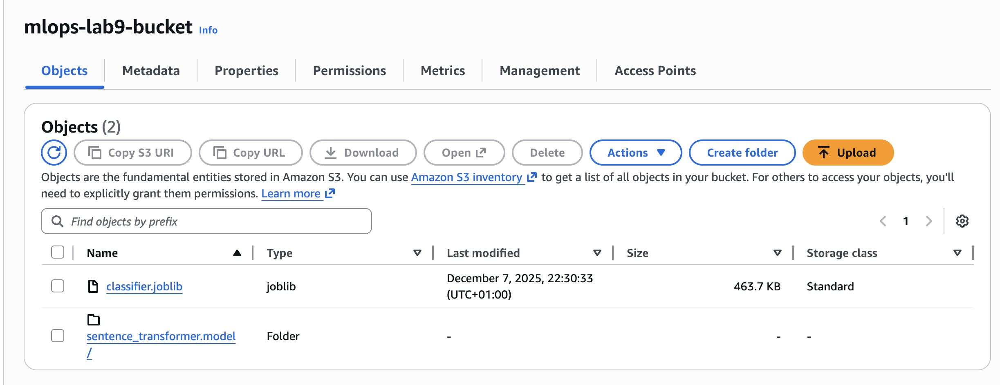
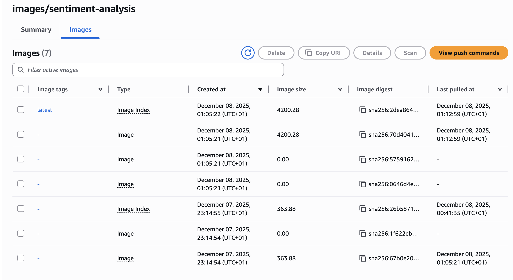
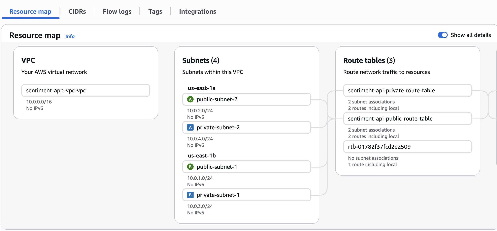
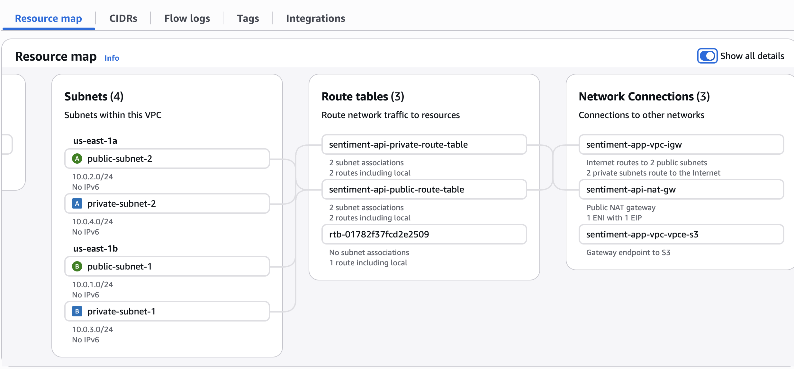
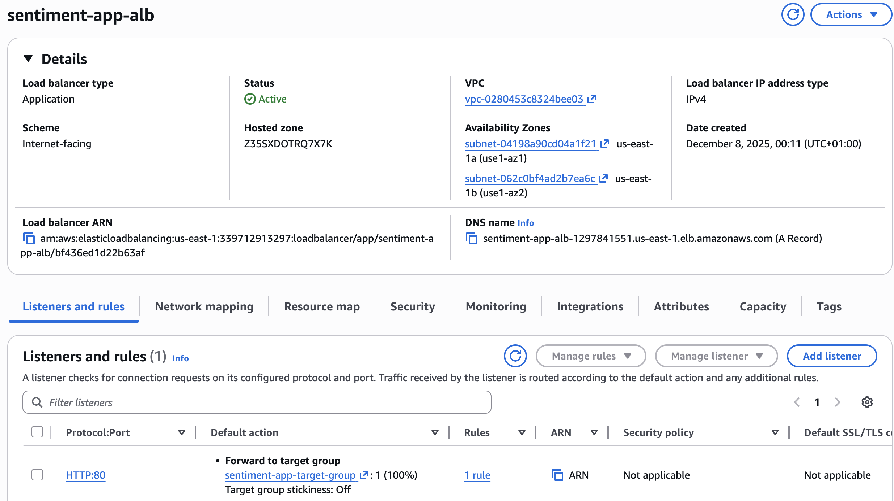
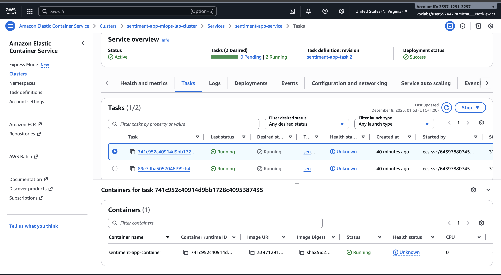
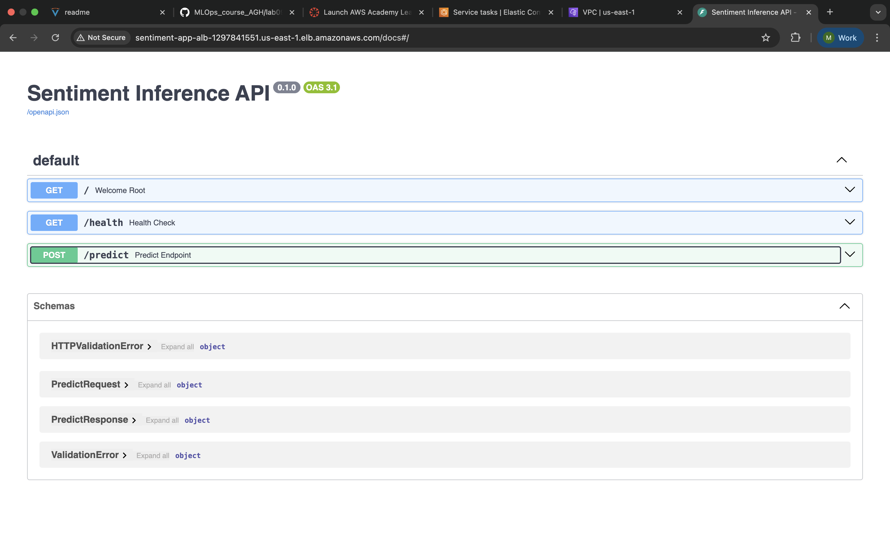

# AWS LAB

## 1. Account setup

I used the aws-learner-lab account

## 2. S3

The model files are available on the s3 

I also added a download script to lab1 task [script](https://github.com/mnozkiewicz/MLOPS/blob/main/lab1/homework/download_models.py).

## 3. ECR

The docker image were pushed to a registry 

The latest image includes builts both for amd and arm architectures, so it could work both locally and linux/amd machines that are used in the fargate service.

## 4. Network setup

The final network schema looks like this

and also ALB

### 5. ECS and Fargate

### 6. Running application

The ready application is accessible through load balancer.

